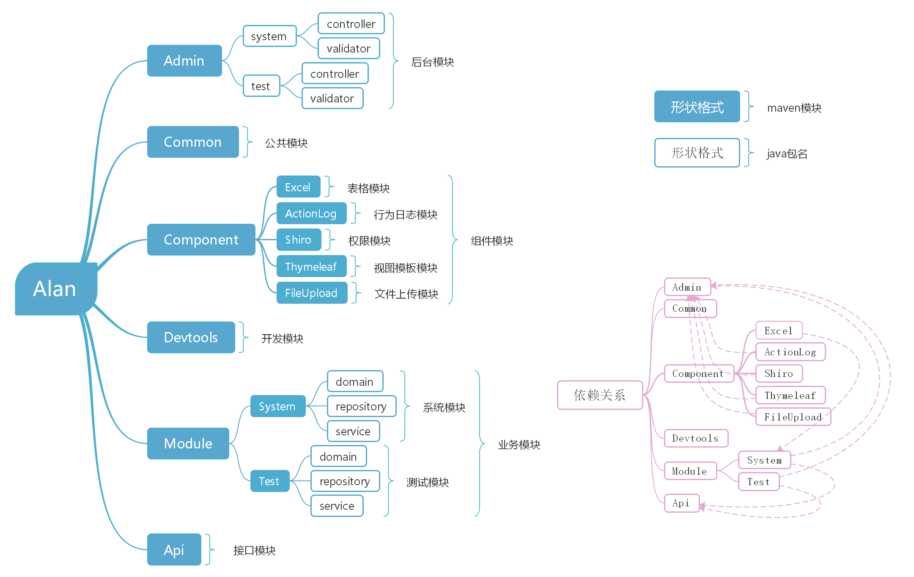

# Alan v2.0.3

 

#### 项目介绍

alan后台管理系统，基于SpringBoot2.0 + Spring Data Jpa + Thymeleaf + Shiro 开发的后台管理系统，采用分模块的方式便于开发和维护，支持前后台模块分别部署，目前支持的功能有：权限管理、部门管理、字典管理、日志记录、文件上传、代码生成等，为快速开发后台系统而生的脚手架！

#### 技术选型

- 后端技术：SpringBoot + Spring Data Jpa + Thymeleaf + Shiro + Jwt + EhCache

- 前端技术：Layui + Jquery  + zTree + Font-awesome

#### 全新的项目结构

#### 功能列表

- 用户管理：用于管理后台系统的用户，可进行增删改查等操作。
- 角色管理：分配权限的最小单元，通过角色给用户分配权限。
- 菜单管理：用于配置系统菜单，同时也作为权限资源。
- 部门管理：通过不同的部门来管理和区分用户。
- 字典管理：对一些需要转换的数据进行统一管理，如：男、女等。
- 行为日志：用于记录用户对系统的操作，同时监视系统运行时发生的错误。
- 文件上传：内置了文件上传接口，方便开发者使用文件上传功能。
- 代码生成：可以帮助开发者快速开发项目，减少不必要的重复操作，花更多精力注重业务实现。
- 表单构建：通过拖拽的方式快速构建一个表单模块。
- 数据接口：根据业务代码自动生成相关的api接口文档

#### 安装教程

- ##### 环境及插件要求

   - Jdk8+
   - Mysql5.5+
   - Maven
   - Lombok（重要）

- ##### 导入项目

   - IntelliJ IDEA：Import Project -> Import Project from external model -> Maven
   - Eclipse：Import -> Exising Mavne Project

- ##### 运行项目

  - 通过Java应用方式运行admin模块下的com.alan.BootApplication.java文件
  - 数据库配置：数据库名称alan   用户root    密码root
  - 访问地址：http://localhost:8080/
  - 默认帐号密码：admin/123456

#### 使用说明

1. SQL文件：sdoc/alan.sql

#### 更新记录
- 2020-11-06更新 重命名菜单类型为：目录、菜单、按钮
- 2020-10-30更新 重写Shiro“记住我”系列化数据，减少cookie体积
- 2020-10-25更新 加入获取用户角色列表方法，修复获取部门数据时延迟加载超时问题
- 2020-10-17更新 1.优化登录js加载不及时问题 2.解决layui弹出窗口最大化问题
- 2020-08-28更新 加入配置项，可直接通过yml文件配置Shiro和XSS防护忽略规则！
- 2020-08-11更新 根据【阿里巴巴Java开发手册】对代码进行优化处理
- 2020-06-14更新 修复接口无法继承多个父接口的问题
- 2020-04-28更新 加入JWT TOKEN鉴权机制，实现多端的权限验证！
- 2020-04-07更新 发布v2.0版本，带来全新的项目结构！
- 2020-02-11更新 修复字典值过长格式显示问题，加入离线技术文档1.0
- 2020-01-17更新 重构字典模块，将mo:dictKey改成mo:dict
- 2020-12-18更新 加入导入导出功能
- 2020-12-13更新 修复代码生成路径出现空格的问题
- 2020-12-10更新 1.加入xss防护 2.加入swagger数据接口文档
- 2020-12-09更新 1.加入QuerySpec动态查询实例 2.加入排序选择功能 3.完善用户部门查询
- 2020-12-07更新 修复文件上传多次的问题，修改上传实体类名称
- 2020-12-05更新 1.支持三级菜单 2.更新管理员权限机制 3.修复若干问题
- 2020-12-03更新 1.加入部门管理功能 2.更新开源协议 3.修复若干问题
- 2020-12-01更新 发布v1.0版本！

#### 演示地址
演示地址： [暂无]()

#### 预览图

